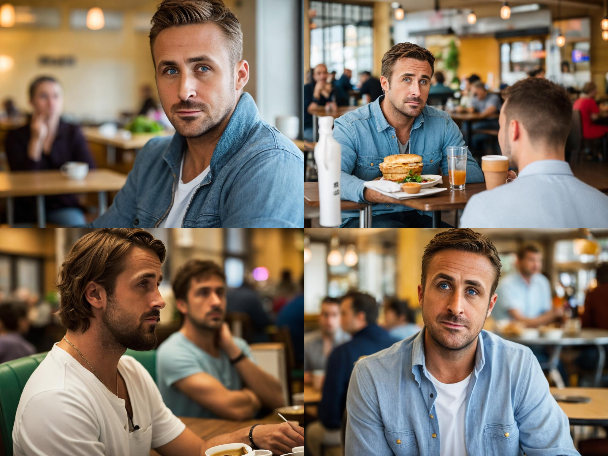
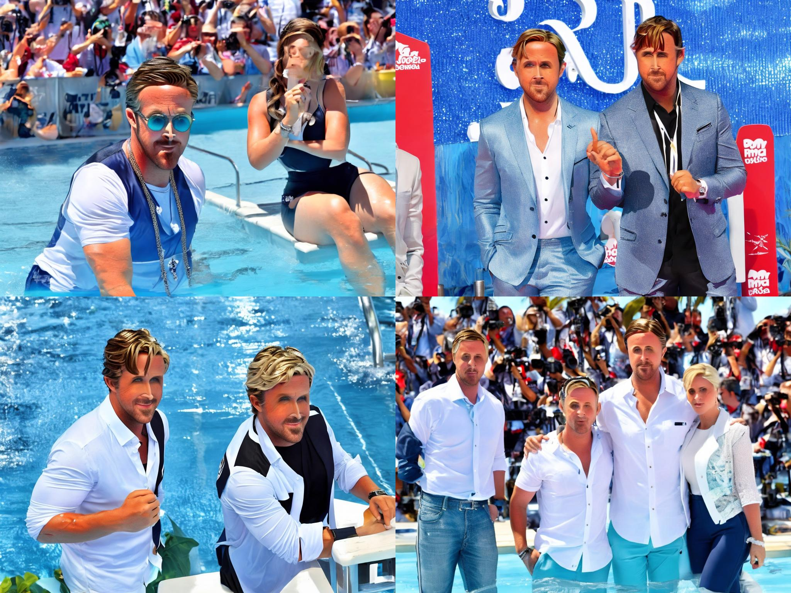

# Диффузия

## SD 1.5

- Примерно 20 изображений Гослинга
- Генерировала class_images для регуляризации в другой версии SD, во время обучения выключила генерацию
- включила gradient_checkpointing, иначе не влезало в память
- Взяла 5 промптов, зафиксировала seed и параметры. Результат:

## LoRA

- Три эксперимента с параметрами rank = 4, 12, 24
- Поменяла lr, иначе качество было совсем ужасное
- С ростом rank как будто начинает переобучаться, но лица получаются немного более релистичные 

rank             |  Cafe          | Car | Desert | Pool | Forest|
:-----------:|:--------------:|:----------:|:---------------:|:------------------------:|:------------------------:
4||||||
12||||||
24||||||

## Cравнение

Очевидно, Лора хуже. Возможно, это из-за того, что Лора меняет веса и склонна к переобучению. 

## Бонус - ControlNet

Взяла известный мем клоуна (https://img.ixbt.site/live/images/original/04/23/83/2023/03/17/e6577fdd13.jpg), использовала метод с Сanny

Результат: 

